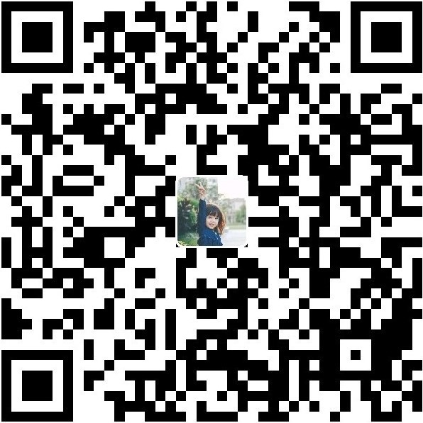

# 各机型第三方刷机包整理汇总

> 起因：想起当初高中时候同桌买了小米1，上课时候都在刷机那时候我就充满了好奇。后来陆陆续续接触了几十款机型，现在第三方适配已成为我选购手机的一个参考因素，所以希望能够整理一份清单出来，方便大家查找。受到[黑果小兵的EFI仓库](https://github.com/daliansky/Hackintosh)的启发，我在其基础上建立了一个汇总第三方ROM的仓库，方便大家一起提交合并，共同维护。

> 所有刷机包都源于作者的劳动成果，所以请不要二次打包和用于商业用途。如果您不希望这个项目收录您的作品，请发送邮件到 [bubble_dirk@163.com](mailto:bubble_dirk@163.com),我将移除与您相关的链接。

> 如果有新的链接希望收录到这份清单或者有旧链接失效的情况，请发送邮件到 [bubble_dirk@163.com](mailto:bubble_dirk@163.com)。

> 声明：所有链接均收集于互联网，大家刷入前请认准版本和注意事项，刷机产生的各种后果本人概不负责。

> 致谢：感谢第三方开发者为我们创造了如此多的乐趣，谢谢！

关于第三方ROM，由于移植等问题，可能存在或多或少的问题，希望大家可以合理反馈，毕竟开发者是无偿在进行开发，谢谢大家！

**刷机前请一定一定备份好自己的数据，否则极有可能无法找回！** 在自己遇到问题的时候，请先通过网络寻找解决办法，无法解决再询问别人，请别人帮忙解决问题的时候，首先端正自己的态度，把问题描述清楚，能提供 log 日志或者是相关文件的先提供文件，提供不了文件的拍照拍清楚。

**解决问题，需要努力的是自己，不是让别人帮你努力；帮你解答是情分，不是义务**

*最后再次谢谢开发者们，由于他们的努力，使我们拥有了更多的玩机的乐趣！*

### 目前项目包含：271款机型

## 关于打赏

如果您认可我的工作，请通过打赏支持我后续的更新

微信 | 支付宝
---|---
 | 

 
